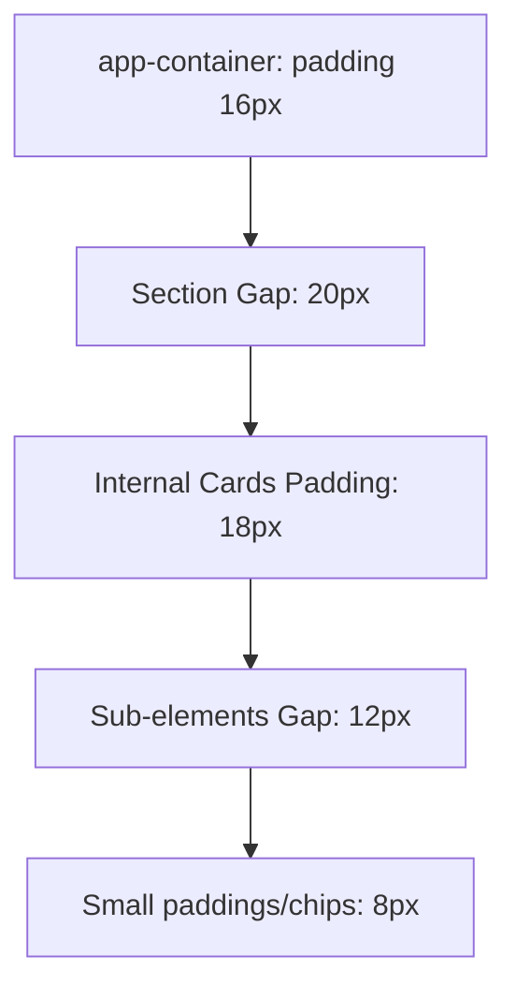

# 🍺 SERVITE FANGER — Manual Técnico y Especificaciones de Diseño

Bienvenido al manual oficial de especificaciones técnicas, tokens de diseño y estándares de arquitectura de la aplicación **SERVITE FANGER**. Este documento sirve como blueprint definitivo para comprender el diseño visual, espaciados exactos, micro-animaciones y la estructura de componentes refactorizada de la plataforma.

---

## 🎨 1. Sistema de Diseño y Paleta de Colores

Para lograr un acabado premium, cálido y sofisticado que evoque la atmósfera de las cervecerías artesanales de alta gama, se implementó una paleta curada con contrastes profundos y tonos crema.

| Token de Color | Valor Hex | Uso de Interfaz / Rol Semántico |
| :--- | :--- | :--- |
| **Cream Sand (Fondo)** | `#F9F4E8` | Fondo principal de la aplicación, relajante y anti-fatiga visual. |
| **Charcoal Black** | `#1A1716` | Headers premium, texto principal, botones primarios y fondos de logotipos blancos (Blest, Temple). |
| **Sunset Orange (Acción)**| `#FF6600` | Botón "Servir", indicadores activos, saldo destacado y alertas. |
| **Champagne Gold** | `#FFBF00` | Bordes dorados de avatares VIP (Sofia Gold, Ian Premium), medallas e isotipos. |
| **Sand Base (Shimmer)** | `#e4d7c5` | Color base para la transición de carga (shimmer loader). |
| **Shimmer sweep** | `#f5ecd6` | Color sweep de pulso para la animación del skeleton loader. |
| **Charcoal Border** | `#2A2625` | Delgados filetes divisorios en áreas oscuras para separar capas. |

---

## 📐 2. Espaciados, Gaps y Grillas (Layout Grid)

Mantenemos un sistema de espaciado extremadamente estricto basado en un multiplicador base de `4px` para asegurar una alineación simétrica impecable en pantallas móviles.



### Especificaciones de Gap por Componente:
* **Gaps Generales de la Página**: `20px` (`var(--section-gap)`) entre secciones mayores (Header ➔ Info Bar ➔ Balance ➔ Canillas).
* **Grid de Logros de Perfil**: `gridTemplateColumns: "repeat(4, 1fr)"` con un `gap: 8px` y padding interior de `10px 4px` para albergar 4 badges perfectamente alineadas en una sola fila móvil sin recortes.
* **Canillas disponibles (`TapsList.tsx`)**: Un contenedor horizontal deslizable con un `gap: 12px` y `padding: 4px` para evitar recortar las sombras dinámicas al hacer foco.
* **Detalle de Bebida (`DrinkCard.tsx`)**:
  * Margen interno (padding): `18px`.
  * Gap entre la descripción y el selector de cantidad: `14px`.
  * Distancia en el control selector de cantidad (`[-] 1 [+]`): `gap: 12px`.
  * Separación del botón de alerta "Cargar saldo exacto": `gap: 8px`.

---

## ⚡ 3. Frameworks, Librerías y Animaciones

La experiencia táctil y fluida de la aplicación se logra combinando React con librerías de animación física (no lineales).

### Framework Core:
* **Next.js 16 (App Router)**: Estructura de enrutamiento basada en el cliente con estados atómicos para simular persistencia instantánea.
* **React 19 / TypeScript 5**: Tipado estricto en todas las interfaces para un desarrollo seguro y libre de errores implícitos.
* **Lucide React**: Set de iconos consistentes y minimalistas.

### Animaciones Físicas (Framer Motion & Custom):

#### 1. Transición de Pestañas (`pageVariants`):
* **Comportamiento**: Desplazamiento sutil hacia arriba (`y: 15` a `0`) con desvanecimiento de opacidad (`0` a `1`).
* **Curva**: `ease-out` con resorte elástico `[0.34, 1.56, 0.64, 1]` que simula peso físico.
* **Duración**: `350ms` con escalonamiento de hijos (`staggerChildren: 0.08`).

#### 2. Vibración de Saldo Insuficiente (Efecto Shake):
* **Comportamiento**: Se activa al pulsar el botón de servir sin fondos suficientes.
* **Keyframes físicos**: `x: [0, -6, 6, -6, 6, -4, 4, 0]`.
* **Duración**: `500ms` a través de la propiedad reactiva `animate` para respetar el estricto tipado TS.

#### 3. Carga Analógica de Dinero (`AnimatedCounter.tsx`):
* **Comportamiento**: Utiliza interpolación cuadrática `ease-out` ligada a `requestAnimationFrame` en lugar de saltar el número estáticamente. El saldo rueda de forma realista como una máquina tragamonedas hasta llegar a su destino.

#### 4. Chop Llenándose progresivamente (Beer Pouring Screen):
* **Líquido**: Gradiente de `0%` a `100%` en el eje `height` a lo largo de `2.4` segundos.
* **Carbonatación**: Burbujas que ascienden continuamente mediante una máscara de desplazamiento lineal infinito.
* **Foam (Espuma)**: Capa blanca con sombra difuminada que emerge en la cresta del líquido y se expande tridimensionalmente al finalizar.

---

## 📁 4. Arquitectura Refactorizada de Carpetas

La aplicación pasó de un único archivo monolítico a un ecosistema de componentes de alta cohesión y bajo acoplamiento:

```bash
servite-fanger/
├── app/
│   ├── layout.tsx         # Contenedor global de la app
│   └── page.tsx           # Entry Point ultraligero (~280 líneas de orquestación)
├── components/
│   ├── auth/
│   │   └── LoginView.tsx  # Pantalla de bienvenida y selección de usuario (Sofia/Ian)
│   ├── layout/
│   │   ├── BottomNav.tsx  # Barra de pestañas inferiores reactiva
│   │   └── Header.tsx     # Barra superior con botón inteligente de volver
│   ├── tabs/
│   │   ├── HomeTab.tsx    # Dashboard principal de bares, filtros y búsquedas
│   │   ├── WalletTab.tsx  # Mock de tarjeta de crédito, cargas y actividad
│   │   ├── LocationTab.tsx# Mapa interactivo vial con balizas GPS pulsing
│   │   └── ProfileTab.tsx # Estadísticas de litros, logros grid y configuraciones
│   └── ui/
│       ├── AnimatedCounter.tsx # Animación real-time de dinero rodante
│       ├── BalanceBox.tsx      # Cajón de saldo del bar con recargas rápidas
│       ├── BarInfo.tsx         # Cabecera de marca y favoritos del bar activo
│       ├── DrinkCard.tsx       # Selección de cantidad, coste y checkout inteligente
│       ├── SkeletonLoader.tsx  # Shimmer de carga beige de alta fidelidad
│       └── TapsList.tsx        # Carrusel deslizable de canillas de cerveza
└── data/
    └── mockData.ts        # Almacén central de objetos estáticos y constantes
```

---

> [!NOTE]
> Todos los componentes están completamente tipados bajo TypeScript. El proyecto cuenta con un proceso de generación estática de Next.js optimizado y libre de warnings.

> [!TIP]
> Si deseas ajustar la velocidad del llenado de cerveza o la animación del contador numérico, puedes cambiar el intervalo del temporizador de `page.tsx` en la función `handleServe` (`120ms` por ciclo) o la constante de paso dentro de `AnimatedCounter.tsx`.
